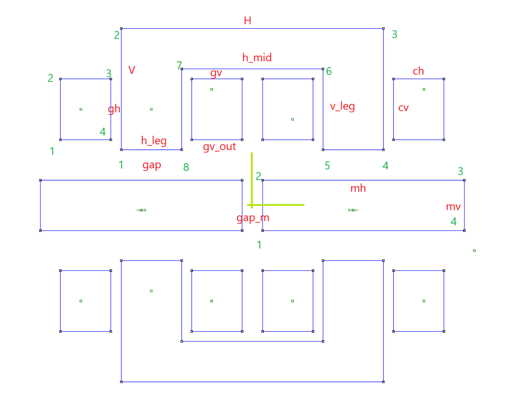
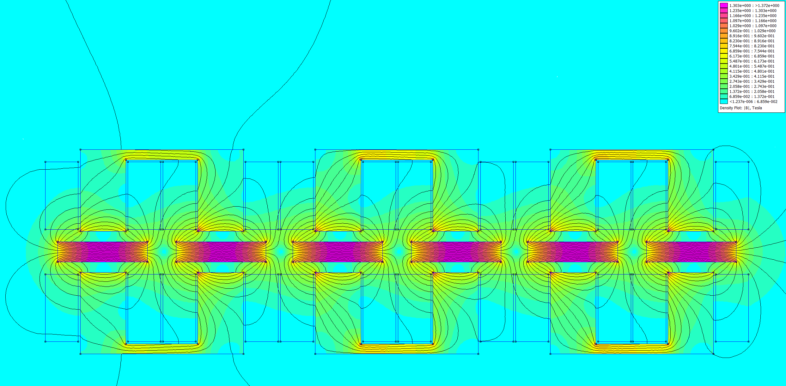

easy_mount_e_bicycle
====================


Parametric calculation of the rim based linear engine for turning normal bicycle to e-bicycle

`c_magnets.py` uses following dimentions:




Results
=======


```
Input data:
{
    "battery_I": 5,
    "battery_V": 48,
    "battery_P": 240,
    "depth": 40,
    "V": 40,
    "H": 80,
    "h_leg": 20.0,
    "v_leg": 25,
    "gv": 0.5,
    "gh": 0.5,
    "h_mid": 40.0,
    "cv": 24.0,
    "ch": 19.25,
    "mh": 56,
    "mv": 5,
    "gap": 5,
    "gap_m": 14,
    "air_material": "Air",
    "core_material": "416 Stainless Steel",
    "magnet_material": "N40",
    "coil_material": [
        "Aluminium 0.8mm",
        [
            1,
            1,
            0,
            10,
            35,
            0.03,
            0,
            0,
            3,
            0,
            0,
            1,
            0.8
        ]
    ],
    "n_turns": 720,
    "magnet_density": 0.0075,
    "iron_density": 0.0078,
    "coil_mat_density": 0.0027,
    "coil_mat_specific_heat": 910
}

Results:
{
    "From calculation (Unlimited battery)": {
        "V_drop": 65.48089087209405,
        "I": 5,
        "P": 327.40445436047025,
        "Fx": 112.9870438649618,
        "delta T for 60sec 1 coil (vacuum)": 86.09791702426669
    },
    "Limited by battery": {
        "V": 48,
        "I": 5,
        "P": 240,
        "Fx": 82.82382895663143,
        "delta T for 60sec 1 coil (vacuum)": 63.11306950965799
    },
    "Weights": {
        "magnet_on_wheel_weight (for 32 spokes) (kg)": 2.604,
        "U_core_weight (6 items) (kg)": 4.1184,
        "coil_weight (12 items) (kg) calculated as solid block": 3.0087288000000005,
        "total witout battery (kg)": 9.7311288
    }
}


                     Regular torque      Medium torque                   High torque
Measurements         40-60Nm             60-80Nm                         80Nm+
Force (28", rim)    148-222             222-296                         296+
Feel                 Normal              Punchy                          POWERRR!!
Battery impact       Normal              Minimal impact over normal      Higher, but battery spec compensates
Best for             Commuting, leisure  More oomph,heavier work         Off-roading, cargo, fun
```


