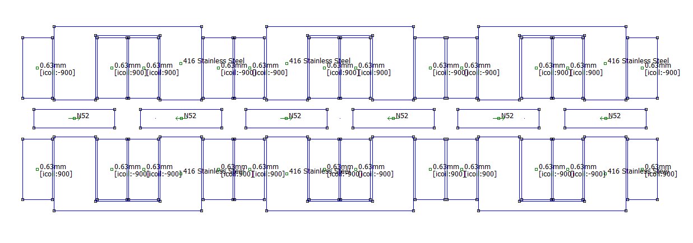

easy_mount_e_bicycle
====================


Parametric calculation of the rim based linear engine for turning normal bicycle to e-bicycle

`c_magnets.py` uses following dimentions:


Results
=======


```
Input data:
{
    "battery_I": 5,
    "battery_V": 48,
    "battery_P": 240,
    "depth": 40,
    "V": 40,
    "H": 80,
    "h_leg": 20.0,
    "v_leg": 25,
    "gv": 0.5,
    "gh": 0.5,
    "h_mid": 40.0,
    "cv": 24.0,
    "ch": 19.25,
    "mh": 56,
    "mv": 5,
    "gap": 5,
    "gap_m": 14,
    "air_material": "Air",
    "core_material": "416 Stainless Steel",
    "magnet_material": "N40",
    "coil_material": "0.8mm",
    "n_turns": 720,
    "magnet_density": 0.0075,
    "iron_density": 0.0078,
    "copper_density": 0.008960000000000001
}

Results:
{
    "V_drop (2 magnets)": 39.51433069867749,
    "I_out (2 magnets)": 5,
    "P_out (2 magnets)": 197.57165349338746,
    "battery_P (2 magnets)": 240,
    "Fx (2 magnets)": 112.9870438649618,
    "battery_Fx (2 magnets)": 137.25091655670337,
    "magnet_on_wheel_weight (31 items) (kg)": 2.604,
    "U_core_weight (6 items) (kg)": 4.118399999999999,
    "coil_weight (12 items) (kg) calculated as solid block": 9.98452224,
    "total weight (kg)": 16.70692224
}
```




